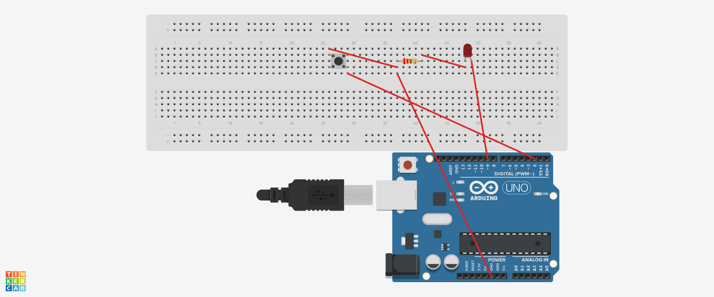

# Day 7 – LED PWM FSM Project

This project demonstrates PWM control of an LED using Finite State Machine (FSM) logic, controlled by a push button on an Arduino Uno.

---

## 🔧 Components

- Arduino Uno
- 1x LED
- 1x 220Ω Resistor
- 1x Push Button
- Breadboard
- Jumper Wires

---

## ⚙️ Project Logic

- LED brightness cycles through three levels: **Low → Medium → High**
- Each button press advances to the next state
- FSM is implemented using a `switch-case` structure
- PWM output is controlled with `analogWrite()`
- Basic debounce logic added using a short `delay()`

---

## 🖥️ Pin Configuration

| Component | Arduino Pin         |
|-----------|----------------------|
| LED (+)   | D9 (PWM output)      |
| LED (–)   | GND via 220Ω resistor |
| Button    | D2 (with INPUT_PULLUP) |
| Button GND | GND                |

---

## 🔌 Circuit Schematic

**Schematic Notes:**
- LED is connected to digital pin D9 for PWM control
- Button is connected to digital pin D2
- 220Ω resistor limits current to the LED
- INPUT_PULLUP is used to stabilize button input

---

## 💾 Code File

- `LED_PWM_FSM.ino`

---

## 🧠 Concepts Practiced

- Digital input using pull-up resistor
- PWM signal modulation
- Finite State Machine (FSM)
- Input debouncing

---

## ✅ Output Preview

Each button press cycles the LED brightness:

[LOW] → [MEDIUM] → [HIGH] → [LOW] → ...

---

## 🎓 Part of: `Embedded-Learn-Journey – Day 7`

This project is part of my 41-day Embedded Systems & IoT journey.

🔗 LinkedIn: [linkedin.com/in/ahmet-emin-yakar-bbb6732a6](https://www.linkedin.com/in/ahmet-emin-yakar-bbb6732a6)
